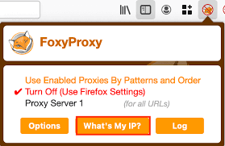
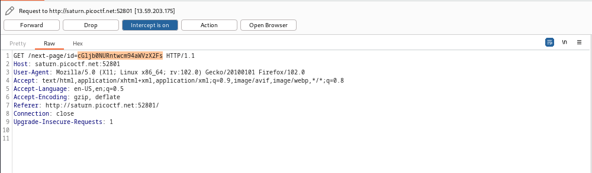
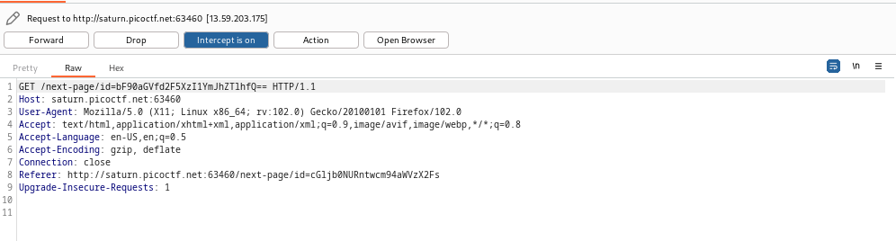
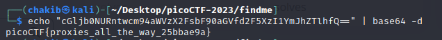

# Solution of find me

1- setup foxy proxy for firefox( or any other proxy)

2- start burpsuite and go to intercept and turn it 
3- turn on proxy
4- login using username:test and password=test!
5- go to burpsuite and forward the first request to get the first part of the flag from the redirect url

6-  re forward the second request to get the second part

7- decode the 2 parts using cyber or cmd
