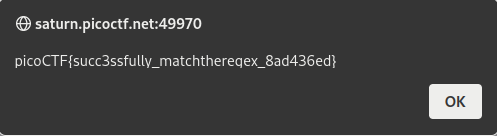

# Solution of MatchTheRegex

1- we know that the format of the flag is picoCTF{xxxxxxxxxxxxxxxxxxxxxx}
2- to match the expression we have two parts
	-fixed part picoCTF{variable part}
	- variable part could be anything which is "." repeated many times

3- so we get "picoCTF{.\*}"
